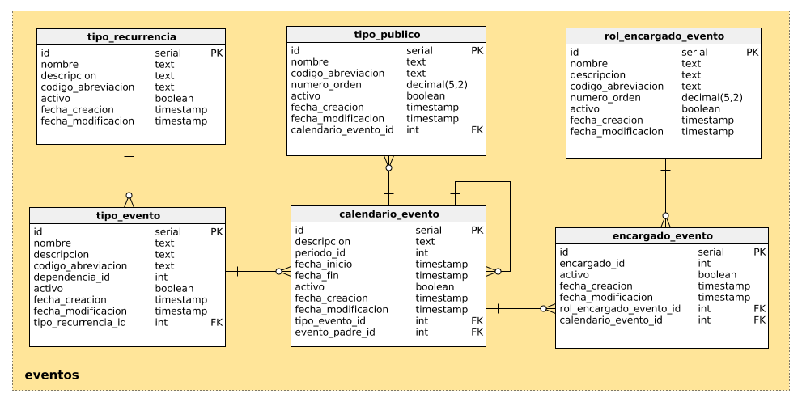

# sesiones_crud
Api para administración de eventos o periodos.
API de core, Integración con CI
sesiones_crud master/develop
## Requirements
Go version >= 1.8.
## Preparation:
Para usar el API:
```shell
go get github.com/udistrital/eventos_crud
```
## Run
Definir los valores de las siguientes variables de entorno:
 - `API_EVENTOS_HTTP_PORT`: Puerto asignado para la ejecución del API
 - `EVENTOS_CRUD__PGUSER`: Usuario de la base de datos
 - `EVENTOS_CRUD__PGPASS`: Clave del usuario para la conexión a la base de datos  
 - `EVENTOS_CRUD__PGURLS`: Host de conexión
 - `EVENTOS_CRUD__PGDB`: Nombre de la base de datos
 - `EVENTOS_CRUD__PGSCHEMA`: Esquema a utilizar en la base de datos
Agregar variables de conexión en el archivo custom.env. En el caso en que el ambiente sea desarrollo local y se vaya a usar con docker-compose se deben ejecutar los siguientes comandos adicionales:
```shell
docker network create back_end #Crear red
touch custom.env #Crear archivo de variables
```
Agregar en el archivo `custom.env` las variables de conexión por ejemplo:
>EVENTOS_CRUD__PGDB=test
>EVENTOS_CRUD__PGPASS=test
>EVENTOS_CRUD__PGURLS=eventos_db
>EVENTOS_CRUD__PGUSER=test
>EVENTOS_CRUD__PGSCHEMA=evento
#### Example prod:
```shell
SESIONES_HTTP_PORT=8095 SESIONES_CRUD__PGUSER=postgres SESIONES_CRUD__PGPASS=password SESIONES_CRUD__PGURLS=localhost SESIONES_CRUD__PGDB=local SESIONES_CRUD__SCHEMA=core_new bee run --downdoc=true --gendoc=true
```
#### Example dev:
```shell
docker-compose up --build -d
```
#### Model DB
.
